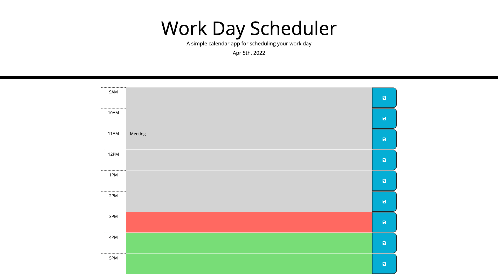

05 Third-Party APIs: Work Day Scheduler

A simple program that lets you schedule your work day on certain times of the day. Grey is the past, current day is red, and green is future. 

Website: https://chrisnunez.github.io/WorkDayScheduler/

Github: https://github.com/chrisnunez/WorkDayScheduler

User Story
AS AN employee with a busy schedule
I WANT to add important events to a daily planner
SO THAT I can manage my time effectively

